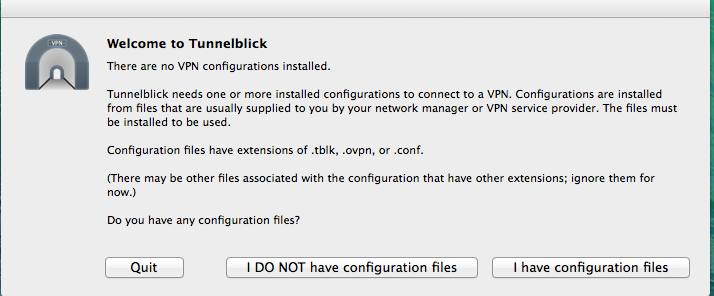
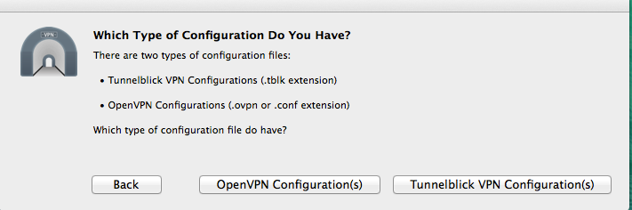
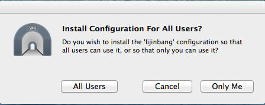
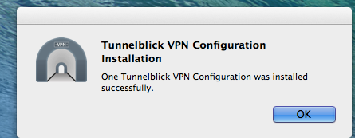
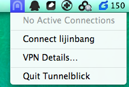
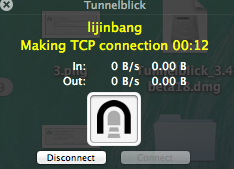
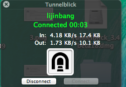
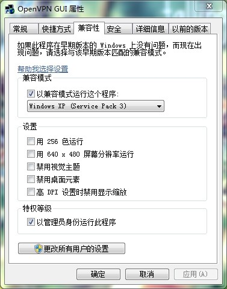

#openvpn

--------

##Server端安装和部署
###安装

```
apt-get install openvpn
```

###配置

```
mkdir /etc/openvpn/easy-rsa/
cp -r /usr/share/doc/openvpn/examples/easy-rsa/2.0/*
```

/etc/openvpn/easy-rsa/vars 修改

```
export KEY_SIZE=2048
export KEY_COUNTRY="CN" 
export KEY_PROVINCE="BJ" 
export KEY_CITY="Beijing" 
export KEY_ORG="snowballfinance" 
export KEY_EMAIL="service@xueqiu.com" 
export KEY_EMAIL=service@xueqiu.com
export KEY_CN=snowballfinance
export KEY_NAME=snowballfinance
export KEY_OU=snowballfinance
export PKCS11_MODULE_PATH=snowballfinance
export PKCS11_PIN=1234

cd /etc/openvpn/easy-rsa/
cp openssl-1.0.0.cnf openssl.cnf
source vars
./clean-all
./build-ca

./build-key-server officevpn
./build-dh

cd keys/
cp ca.crt /etc/openvpn/
cp officevpn.crt /etc/openvpn/
cp officevpn.key /etc/openvpn/
cp dh2048.pem /etc/openvpn/

cp /usr/share/doc/openvpn/examples/sample-config-files/server.conf.gz /etc/openvpn/
gzip -d /etc/openvpn/server.conf.gz
做相应修改，包括路由
push "route 192.168.1.33 255.255.255.255" 
dh xxx.pem
cert xxx.crt
key xxx.key

```
可供参考的[openvpn的sever.conf配置](file/openvpn/server.conf)

### 设置iptables

```
*filter
...
-A INPUT -i tun+ -j ACCEPT
-A INPUT -i tap+ -j ACCEPT
-A FORWARD -d 10.8.0.0/24 -j ACCEPT
-A FORWARD -i tap+ -j ACCEPT
-A FORWARD -i tun+ -j ACCEPT

*nat
...

-A POSTROUTING -s 10.9.0.0/24  -j MASQUERADE
```

--------
##创建vpn帐号

在vpn服务器上执行如何命令

```
cd /etc/openvpn/easy-rsa/
source vars
./build-key  xxx
在/etc/openvpn/easy-rsa/keys目录下会看到新生成xxx.key和xxx.crt,把这两文件下载下来
```

创建一个文件夹xxx.tblk, 把xxx.key、xxx.crt和ca.crt、config.ovpn放到文件夹下，其中ca.crt和config.ovpn配置见附件
其中要把config.ovpn中下面内容改为合适的用户名。

```
cert xxx.crt
key  xxx.key
```

[config.ovpn](file/openvpn/config.ovpn)

--------
##客户端使用

###公司openvpn使用教程( mac 篇)
一 安装openvpn客户端软件和导入配置文件及密钥¶

1. 下载最新版 vpn客户端，并安装
https://sourceforge.net/projects/tunnelblick/files/All%20files/Tunnelblick_3.4beta18.dmg/download
安装过程需要机器的管理员密码。
2. 安装完成如下图所示，点击"Launch" <br>

3. 运行点击”I have confinguration files”<br>

4. 点击”Tunnelblick VPN Configuration(s)“<br>

5. 把邮件中附件解压，xxx.tblk （其中xxx为用户名），双击文件夹，出现下面界面，点击”Only Me”<br>
 
6. 提示输入本地管理员密码
7. 出现下面界面表示配置文件导入成功<br>
 

二 测试和使用vpn

注意：目前在办公室网络下不能使用，如果想测试， 可以使用手机的wifi个人热点，让电脑通过3G网络测试。

1. 在右上状态栏，点击”Tunnlblick”小图标， 点击”Connect xxx“， （其中xxx为用户名）<br>
 
2. 黄色字体表示正在建立连接<br>
 
3. 绿色字体表示连接成功，即可以使用<br>
 
4.  断开连接，点击”Tunnlblick”小图标中”Disconnect xxx”<br>
 


###vpn客户端使用教程(window7)

一 安装软件

从http://swupdate.openvpn.org/community/releases/openvpn-2.1.4-install.exe下载openvpn客户端，访问该网站需要翻墙，或直接向我要。

双击安装，，安装成功，在桌面会出现如下图标  

二 配置

1）把我发给大家的配置xxx.tblk  （其中xxx为用户名）解压，把文件夹下的如下四个文件ca、config、xxx和xxx.key(其中xxx表示用户用户名)拷贝
到C:\Program Files (x86)\OpenVPN\config\ 目录下。

2）点击桌面上的OpenVPN GUI客户端 ,点击右键“属性“，在弹出的属性框选”兼容性“，勾选如下两项：
a)以兼容模式运行这个程序 Windows XP(Service Pack 3)
b)以管理员身份运行此程序<br>
 

点击“确定“

三 运行

重新运行OpenVPN GUI 即可